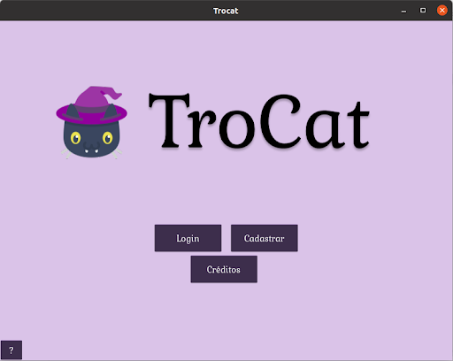

---

  
  
  
  
  

Um sistema distribuído voltado para a troca de itens, o qual foi desenvolvido como um trabalho prático da disciplina de Sistemas Distribuídos e Paralelos - CCF 355.

## Background do sistema

A origem do **TroCat** remonta a metrópole conhecida como Galáctica, a qual apesar do nome, trata-se de uma cidade comum do início da década de 20. Neste local, dentre seus diversos estabelecimentos, havia uma café de gato desconhecido e decadente, o qual o destino certeiro de seus empregados e felinos seria a sarjeta. O estabelecimento, o qual seu nome original já há muito está esquecido, teve seu futuro alterado quando um indivíduo, autodenominado Merin, adquiriu o local.

Com a mudança de possuinte, uma série de transformações foram instauradas, dentre elas: o espaço do estabelecimento foi reformado de maneira que houvessem
variados cômodos temáticos e, o mais importante, o acesso aos serviços do café não seria mais feito por meio de recursos monetários.
Para que fosse possível ser agraciado com a companhia de algum felino do local, a pessoa interessada deveria ter em sua posse um item conhecido como **voucher**.
Trata-se de uma ficha especializada que agrega informações referentes ao acesso a serviços do café, na qual é especificado um gatinho, um dos locais temáticos, um lanche e a quantidade de tempo que o dono daquele voucher poderá usufruir da companhia do felino. Após a expiração de tal tempo o cliente é convidado a se retirar para a área de entrada do estabelecimento.

O acesso aos vouchers é feito por meio de uma distribuição aleatória realizada por um algoritmo desenvolvido por Merin, o qual suas regras são desconhecidas pelo público. Contudo, é de conhecimento dos clientes que o algoritmo foi projetado com o intuito de evitar o acúmulo de vouchers por qualquer indivíduo.

Dado este cenário, não é possível um cliente escolher com qual gato irá passar a companhia e nem a quantidade de tempo. Com o objetivo de fornecer mais possibilidades para os clientes do estabelecimento, o TroCat foi desenvolvido. Esse sistema possibilita a troca de vouchers entre os clientes, ou seja, mediante o acordo entre as duas partes eles poderão intercambiar os vouchers inicialmente atribuídos.

##  Funcionalidades do projeto

- `Funcionalidade 1`: Cadastro de usuários
- `Funcionalidade 2`: Visualização de todos os vouchers cadastros no sistema
- `Funcionalidade 3`: Visualização dos vouchers do usuário logado
- `Funcionalidade 4`: Cadastro de novos vouchers
- `Funcionalidade 5`: Realização de propostas de trocas de vouchers
- `Funcionalidade 6`: Visualização de propostas de trocas pendentes e possibilidade de aceitá-las ou recusá-las

  

---

## Abrir e rodar o projeto

1. Clone o projeto

        git clone https://github.com/otaviouss/Sistema-Distribuido-Flask.git

2. Crie um ambiente virtual

        python3 -m venv "nome_ambiente"

3. Ative o ambiente

        source nome_ambiente/bin/activate

4. Execução simplificada

        make init

    Para instalar os pacotes necessários.

        make server

    Para inicializar o servidor.

    Em outro terminal:

        make client

    Para iniciar o cliente.

5. Outra opção, é não utilizar o makefile e seguir os seguintes passsos.

    Instale as dependências listadas no arquivo requirements.txt utilizando o seguinte comando:

        pip3 install -r requirements.txt

    Após a instalação das dependências, execute o seguinte comando dentro da pasta servidor:

        cd servidor/bd

        prisma generate

    O objetivo desse comando é gerar a conexão com o banco por meio do prisma.

    Em seguida, execute o seguinte comando:

        prisma py fetch

    Esse comando instala as dependências do prisma. Pode ser necessário rodar esse comando se o programa for executado um tempo depois de já ter sido executado. Além disso, às vezes esse comando leva muito tempo para chegar aos 100% e pode ser cancelado nos 80% e ainda assim irá funcionar

    Por fim, execute o servidor em um terminal no diretório base usando:

        python3 run.py

    E em outro terminal, de dentro da pasta interface, execute o cliente:

        cd interface

        python3 main.py

---

Observação: Algumas informações podem ser impressas no terminal tanto do servidor quanto do cliente, o que pode facilitar o entendimento do que está acontecendo no back-end do programa.

---
[Arte logo]("https://www.flaticon.com/free-icons/black-cat")